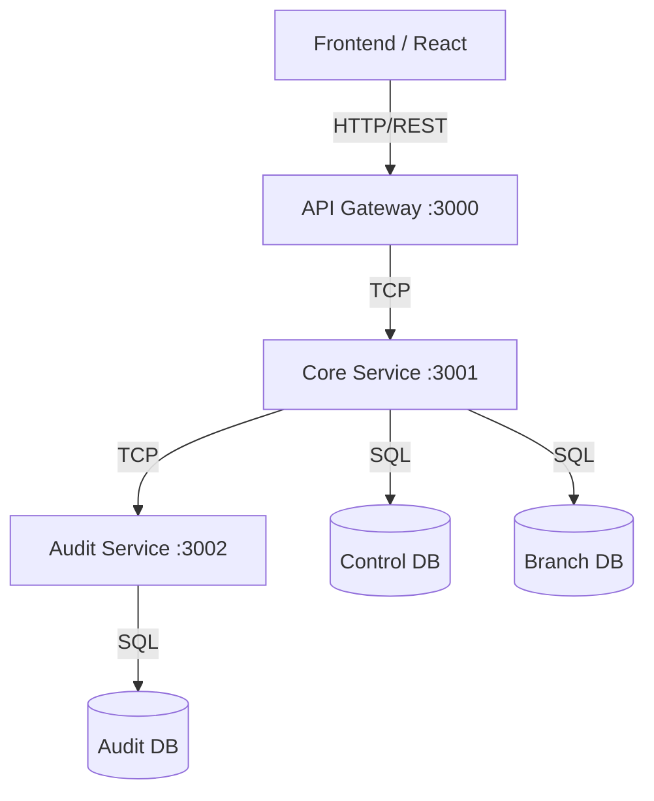

# Architecture

GastroFlow SaaS is structured using a Microservices Architecture on the backend and a Single Page Application (SPA) on the frontend.

## Diagram

- **api-gateway**: Validates and routes HTTP requests.
- **core-service**: Contains the main business logic and manages multi-tenancy.
- **audit-service**: Receives events to store securely in its own database.
