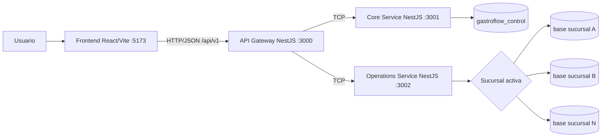

# Arquitectura definitiva

## Vista de contenedores

## Límites

### API Gateway

Es la única superficie HTTP para frontend y Postman. Versionará recursos bajo `/api/v1`, transformará solicitudes HTTP en mensajes TCP y compondrá respuestas. No usa Prisma ni mantiene conexión directa con PostgreSQL.

### Core Service

Es dueño de `gastroflow_control`. Gestionará restaurantes, sucursales, planes, suscripciones, usuarios, perfiles de empleado, roles, permisos, membresías y selección autorizada de sucursal. La autenticación se implementará en fases posteriores.

### Operations Service

Es dueño del schema operacional y de la selección dinámica de conexión. Cada solicitud funcional deberá llegar con una identidad de sucursal previamente autorizada. El servicio no creará una aplicación distinta por sucursal.

### Frontend

Presenta una sola aplicación para todos los restaurantes. Tras iniciar sesión mostrará las sucursales autorizadas, permitirá elegir una y usará exclusivamente el Gateway.

## Flujo futuro de selección

1. El usuario se autentica.
2. Core devuelve las sucursales permitidas.
3. El usuario envía `POST /api/v1/session/branch`.
4. Core valida `UserBranch`, estado y roles.
5. Se emite o actualiza un contexto con `userId`, `restaurantId`, `branchId`, roles y permisos.
6. Operations resuelve la conexión de esa sucursal.
7. Toda operación posterior se ejecuta contra una sola base operacional.

## Estado observado

Fase 1 deja operativa la comunicación HTTP/TCP y los health checks sin PostgreSQL. API Gateway usa `/api/v1`, CORS y timeout configurables; Core y Operations arrancan como microservicios TCP con apagado ordenado. Los módulos Prisma provisionales permanecen en el repositorio, pero fueron desacoplados del `AppModule` técnico para no exigir una conexión durante health.

La persistencia provisional todavía no coincide con la arquitectura congelada: usa bases globales `gastroflow_personal`, `gastroflow_clientes` y `gastroflow_operaciones`, más filtros `restaurantId`. Se reemplazará de forma revisada en Fase 2 y no se ejecutó durante Fase 1.

## Restricciones arquitectónicas

- Sin Nx, monorepo NestJS ni carpeta `apps`.
- Sin servicios, Gateway o frontend por sucursal.
- Sin acceso del frontend a PostgreSQL.
- Sin `branchId` repetido en todas las tablas operacionales.
- Sin clonación de historial al crear una sucursal.
- Sin secretos de conexión enviados por clientes.
