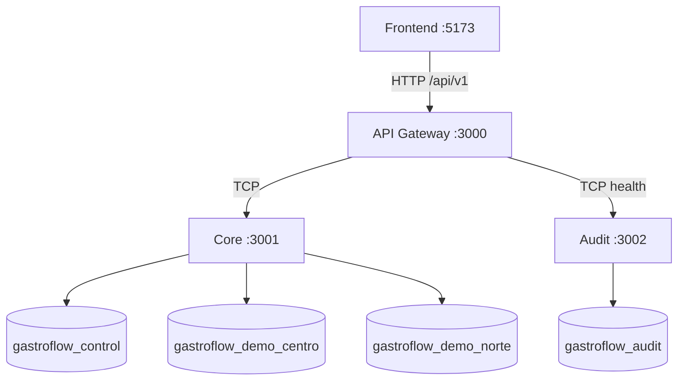

# Arquitectura de GastroFlow

GastroFlow conserva cuatro proyectos independientes: React/Vite, API Gateway HTTP, Core TCP y Audit TCP. Cada uno mantiene package, build y configuración propios.

El Gateway no depende de Prisma. Core consulta Control para seleccionar una base operacional y mantiene un cliente cacheado por sucursal. Audit sólo accede a su propia base. Las bases pueden vivir en un servidor PostgreSQL de desarrollo, pero son bases lógicas y físicas distintas.

La Fase 2 define modelos de usuarios, productos, inventario, pedidos y pagos para evolución futura; no expone aún sus endpoints ni afirma que esa lógica esté implementada.
