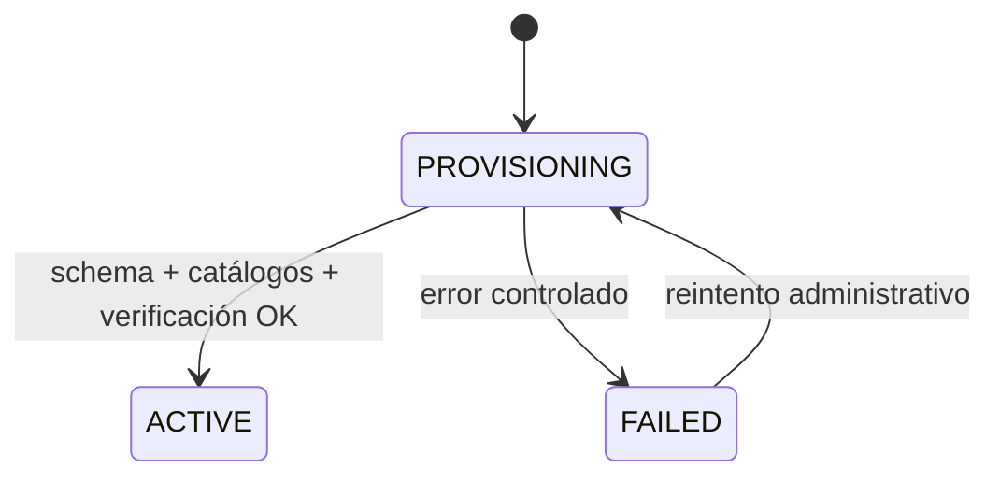

# Modelo de sucursales

## Estado de Fase 2

`Branch`, `UserBranch` y `UserBranchRole` están implementados en `gastroflow_control`. Las credenciales se cifran con AES-256-GCM y sólo Core puede descifrarlas para Operations por TCP. Principal y Norte demostraron selección dinámica, caché y aislamiento físico. El endpoint público de creación permanece pendiente.

## Definición

`Branch` representa una ubicación operativa de un restaurante. Se almacena en `gastroflow_control` y mantiene la referencia necesaria para que Operations resuelva su base. No es una instancia de aplicación ni un microservicio.

## Datos futuros

El diseño de Fase 2 deberá precisar, al menos:

- identidad, `restaurantId`, nombre y código estable;
- dirección, ubicación, teléfono y descripción;
- estado de provisionamiento;
- referencia segura de conexión, sin exponer credenciales en APIs;
- versión del schema operacional;
- timestamps y datos de fallo útiles para recuperación.

Los nombres físicos y secretos de base son datos internos. No forman parte del DTO público de creación.

## Provisionamiento futuro

La operación debe ser idempotente o contar con compensación: registrar la intención central, crear la base con un nombre seguro, aplicar el schema, copiar catálogos, inicializar configuración y secuencia, asignar propietario, verificar y activar. Los pasos y errores deben poder auditarse sin registrar contraseñas.

## Selección futura

`POST /api/v1/session/branch` recibirá un identificador de sucursal, no una URL de conexión. Core comprobará que la sucursal pertenezca al restaurante, esté activa y que el usuario tenga un `UserBranch` válido. Sólo entonces se formará el contexto de sucursal activa.

## Plantilla

Se pueden copiar categorías, platillos y definiciones de inventario. Las cantidades, costos, secuencias, ventas y dashboard se inicializan en cero. No se copian operaciones ni documentos históricos.

## Estado

`DOCUMENTED`. No existen todavía el modelo central definitivo, el endpoint, el provisionador ni el selector dinámico válidos para esta arquitectura.
