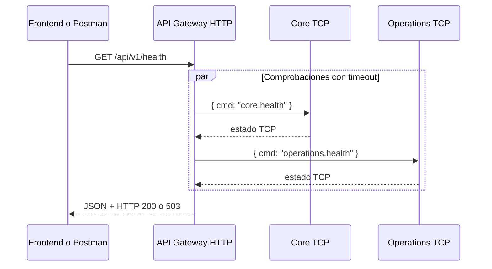

# Arquitectura cliente-servidor

## Participantes

- Frontend React: cliente web en `http://localhost:5173`.
- Postman: cliente técnico para probar la API.
- API Gateway: servidor HTTP público en `http://localhost:3000`.
- Core Service: servidor TCP interno en `127.0.0.1:3001`.
- Operations Service: servidor TCP interno en `127.0.0.1:3002`.

El frontend nunca llama directamente a Core u Operations y ninguno de esos servicios expone HTTP en Fase 1.

## Ciclo request-response

El cliente crea un request con método, URL y headers. El Gateway consulta en paralelo a los dos servidores internos, compone el body JSON y devuelve un response. Si un servicio no contesta antes de `MICROSERVICE_TIMEOUT_MS`, lo marca `unavailable` sin exponer el error interno.

La pantalla técnica no usa estados simulados cuando el Gateway responde. Si recibe un 503, muestra los estados reales del body; si no logra conectar con el Gateway, presenta un mensaje de red entendible.
